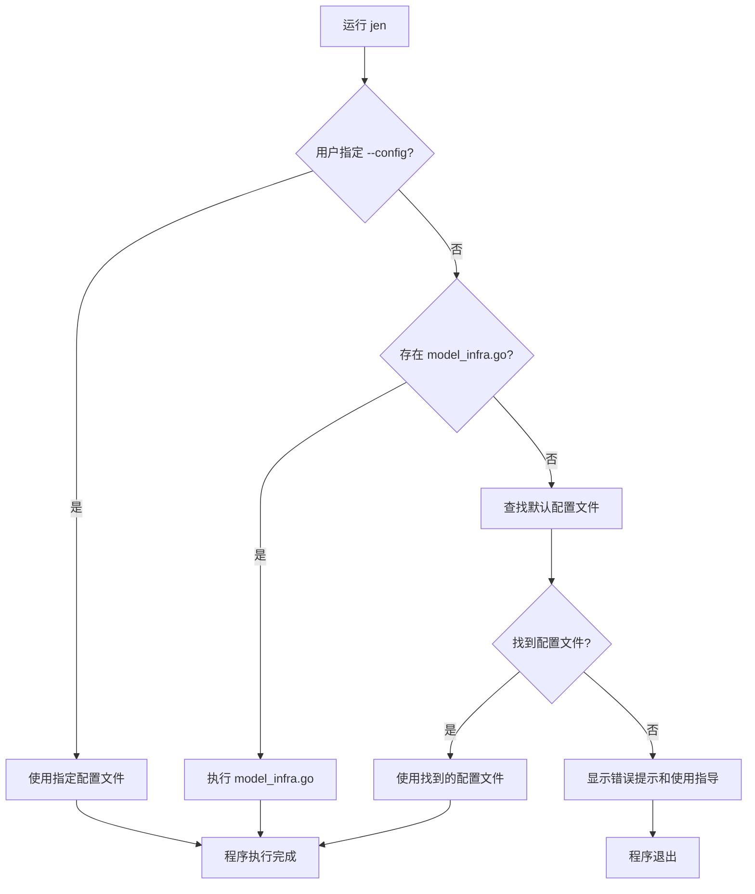

# Model Infrax - Go 数据库代码生成工具

[](https://golang.org)
[](LICENSE)
[](https://github.com/LingoJack/model_infrax)

Model Infrax 是一个强大的 Go 语言数据库代码生成工具，能够从数据库结构或 SQL 文件自动生成完整的模型层代码，包括 Entity、DTO、DAO 等文件。支持多种使用模式和框架适配。

## ✨ 特性

- 🚀 **多种使用方式**：支持命令行工具和 Go 库两种使用方式
- 📦 **多种生成模式**：支持从数据库连接或 SQL 文件生成代码
- 🤖 **智能运行模式**：自动检测并选择最佳运行方式，支持编程式控制和声明式配置
- 🎯 **优先级自动降级**：用户指定优先，智能降级到可用方式
- 📋 **完整代码结构**：自动生成 Entity、DTO、VO、DAO 和工具类
- 🎯 **灵活配置**：支持 YAML 配置文件和 Builder 模式 API
- 🔧 **框架适配**：支持原生 GORM 和 itea-go 框架
- ⚡ **智能优化**：支持索引字段优化和表名前缀处理
- 🛠️ **依赖注入**：使用 Wire 进行依赖注入，代码结构清晰
- 📝 **类型安全**：完整的类型定义和错误处理
- 🔍 **智能配置查找**：自动按优先级查找配置文件

## 🚀 快速开始

### 安装

```bash
# 作为 Go 库使用
go get github.com/LingoJack/model_infrax

# 安装命令行工具
go install github.com/LingoJack/model_infrax/cmd/jen@latest
```

### 三分钟上手

#### 方式一：零配置快速体验（推荐新手）

1. 创建 `model_infra.go` 文件：
```go
//go:build codegen
// +build codegen

package main

import "github.com/LingoJack/model_infrax/jen"

func main() {
    // 从数据库生成代码
    builder := jen.NewBuilder().
        DatabaseMode("localhost", 3306, "mydb", "root", "password").
        AllTables().
        OutputPath("./output")
    
    err := jen.Generate(builder)
    if err != nil {
        panic(err)
    }
}
```

2. 直接运行：
```bash
jen
```

#### 方式二：配置文件模式（推荐团队使用）

1. 创建 `application.yml`：
```yaml
generate_config:
  generate_mode: database
  database_name: mydb
  host: localhost
  port: 3306
  username: root
  password: password
  all_tables: true

generate_option:
  output_path: ./output
  ignore_table_name_prefix: true
  use_framework: itea-go
```

2. 运行：
```bash
jen
```

#### 方式三：指定配置文件（推荐生产环境）

```bash
jen --config ./my-config.yml
```

### 基础使用

#### 方式一：使用 Builder 模式 API

```go
//go:build codegen
// +build codegen

package main

import "github.com/LingoJack/model_infrax/jen"

func main() {
    // 从数据库生成代码
    builder := jen.NewBuilder().
        DatabaseMode("localhost", 3306, "mydb", "root", "password").
        AllTables().
        OutputPath("./output").
        IgnoreTableNamePrefix(true).
        UseFramework("itea-go")
    
    err := jen.Generate(builder)
    if err != nil {
        panic(err)
    }
}
```

#### 方式二：使用配置文件

创建 `application.yml` 配置文件：

```yaml
generate_config:
  generate_mode: database
  database_name: mydb
  host: localhost
  port: 3306
  username: root
  password: password
  all_tables: true

generate_option:
  output_path: ./output
  ignore_table_name_prefix: true
  use_framework: itea-go
  package_name:
    po_package: model/entity
    dto_package: model/query
    vo_package: model/view
    dao_package: dao
    tool_package: tool
```

然后使用配置文件生成：

```go
//go:build codegen
// +build codegen

package main

import "github.com/LingoJack/model_infrax/jen"

func main() {
    // 从配置文件生成代码
    err := jen.GenerateFromConfig("./application.yml")
    if err != nil {
        panic(err)
    }
}
```

## 📊 使用方式对比

| 特性 | Go 文件模式 | 配置文件模式 | 指定配置模式 |
|------|-------------|-------------|-------------|
| **使用场景** | 快速原型、自定义逻辑 | 团队协作、标准化部署 | 生产环境、CI/CD |
| **灵活性** | ⭐⭐⭐⭐⭐ | ⭐⭐⭐ | ⭐⭐⭐⭐ |
| **易用性** | ⭐⭐⭐ | ⭐⭐⭐⭐⭐ | ⭐⭐⭐⭐ |
| **可维护性** | ⭐⭐⭐ | ⭐⭐⭐⭐⭐ | ⭐⭐⭐⭐ |
| **版本控制** | ⭐⭐ | ⭐⭐⭐⭐⭐ | ⭐⭐⭐⭐⭐ |
| **启动方式** | `jen` (自动检测) | `jen` (自动检测) | `jen --config file.yml` |
| **适用人群** | 开发者、实验者 | 团队、运维人员 | 生产环境管理员 |

### 🎯 如何选择？

- **个人开发/快速实验** → 使用 Go 文件模式
- **团队协作/标准化** → 使用配置文件模式  
- **生产环境/自动化** → 使用指定配置模式

---

## 📖 使用模式

### 1. 数据库模式

直接连接数据库，实时获取表结构：

```go
//go:build codegen
// +build codegen

package main

import "github.com/LingoJack/model_infrax/jen"

func main() {
    builder := jen.NewBuilder().
        DatabaseMode("localhost", 3306, "mydb", "root", "password").
        Tables("users", "orders").  // 指定表名
        OutputPath("./model")
    
    err := jen.Generate(builder)
    if err != nil {
        panic(err)
    }
}
```

### 2. SQL 文件模式

从 SQL 建表语句生成代码，无需数据库连接：

```go
//go:build codegen
// +build codegen

package main

import "github.com/LingoJack/model_infrax/jen"

func main() {
    builder := jen.NewBuilder().
        StatementMode("./schema.sql").
        AllTables().
        OutputPath("./model")
    
    err := jen.Generate(builder)
    if err != nil {
        panic(err)
    }
}
```

## ⚙️ 配置选项

### Builder API 完整配置

```go
//go:build codegen
// +build codegen

package main

import "github.com/LingoJack/model_infrax/jen"

func main() {
    builder := jen.NewBuilder().
        // 生成模式选择
        DatabaseMode("host", port, "db", "user", "pass").  // 数据库模式
        // StatementMode("./schema.sql").                   // SQL文件模式
        
        // 表选择
        AllTables().                                      // 所有表
        // Tables("users", "orders").                     // 指定表
        
        // 输出配置
        OutputPath("./output").                          // 输出路径
        IgnoreTableNamePrefix(true).                     // 忽略表名前缀
        CrudOnlyIdx(true).                               // 只为索引字段生成CRUD
        ModelAllInOneFile(true, "models.go").           // 合并到一个文件
        
        // 框架和包配置
        UseFramework("itea-go").                        // 使用框架
        Packages("po", "dto", "vo", "dao", "tool")      // 配置包名
    
    // 执行生成
    err := jen.Generate(builder)
    if err != nil {
        panic(err)
    }
}
```

### 配置文件完整选项

```yaml
generate_config:
  # 生成模式: database 或 statement
  generate_mode: database
  
  # database 模式配置
  database_name: mydb
  host: localhost
  port: 3306
  username: root
  password: password
  
  # statement 模式配置
  sql_file_path: ./schema.sql
  
  # 通用配置
  all_tables: false
  table_names:
    - users
    - orders

generate_option:
  # 输出配置
  output_path: ./output
  ignore_table_name_prefix: false
  crud_only_idx: false
  all_model_in_one_file: false
  all_model_in_one_file_name: model.go
  
  # 框架配置
  use_framework: ""  # 留空为原生GORM，支持 "itea-go"
  
  # 包名配置
  package_name:
    po_package: model/entity
    dto_package: model/query
    vo_package: model/view
    dao_package: dao
    tool_package: tool
```

## 📁 生成的代码结构

```
output/
├── model/
│   ├── entity/           # 数据库实体 (PO)
│   │   └── user.go
│   ├── query/            # 查询对象 (DTO)
│   │   └── user_dto.go
│   └── view/             # 视图对象 (VO)
│       └── user_vo.go
├── dao/                  # 数据访问层
│   └── user_dao.go
└── tool/                 # 工具类
    ├── copy.go           # 对象复制工具
    ├── encode.go         # 编码工具
    ├── ptr.go           # 指针工具
    └── str.go           # 字符串工具
```

## 🎯 支持的框架

### 原生 GORM
生成标准的 GORM 模型和查询方法：

```go
// 生成的实体示例
type User struct {
    ID   uint   `gorm:"primaryKey"`
    Name string `gorm:"size:100"`
    Age  int
}

// 生成的查询方法
func (d *UserDAO) FindByID(id uint) (*entity.User, error) {
    var user entity.User
    err := d.db.First(&user, id).Error
    return &user, err
}
```

### itea-go 框架
生成适配 itea-go 框架的代码，包含特定的注解和工具方法。

## 📚 示例项目

查看 [`examples/`](examples/) 目录获取更多使用示例：

- [基础示例](examples/basic/) - 使用配置文件
- [数据库模式](examples/database/) - 从数据库生成
- [SQL文件模式](examples/statement/) - 从SQL文件生成
- [高级用法](examples/advanced/) - 更多配置选项

## 🔧 高级用法

### 批量生成多服务代码

```go
//go:build codegen
// +build codegen

package main

import "github.com/LingoJack/model_infrax/jen"

func main() {
    // 定义多个服务及其对应的表
    services := map[string][]string{
        "user_service":    {"t_user", "t_role"},
        "order_service":   {"t_order", "t_order_item"},
        "product_service": {"t_product", "t_category"},
    }

    // 批量生成各服务的代码
    for service, tables := range services {
        builder := jen.NewBuilder().
            DatabaseMode("localhost", 3306, "mydb", "root", "password").
            Tables(tables...).
            OutputPath("./services/" + service + "/model").
            IgnoreTableNamePrefix(true)
        
        err := jen.Generate(builder)
        if err != nil {
            panic(err)
        }
    }
}
```

### 自定义数据库连接模板

```go
//go:build codegen
// +build codegen

package main

import "github.com/LingoJack/model_infrax/jen"

func main() {
    builder := jen.NewBuilder().
        DatabaseMode("localhost", 3306, "mydb", "root", "password").
        URLTemplate("mysql://%s:%s@tcp(%s:%d)/%s?charset=utf8mb4&parseTime=True&loc=Local")
    
    err := jen.Generate(builder)
    if err != nil {
        panic(err)
    }
}
```

## 🛠️ 开发

### 环境要求

- Go 1.25.1+
- MySQL 5.7+ (使用 database 模式时)

### 构建项目

```bash
# 构建 API 库
go build .

# 构建命令行工具
go build -o jen ./cmd/jen

# 运行测试
go test ./...

# 生成 Wire 依赖注入代码
go generate ./...

# 安装命令行工具到本地
go install ./cmd/jen
```

### 项目结构

```
model_infrax/
├── api.go              # 对外 API 接口
├── cmd/                # 命令行工具
│   └── jen/           # jen 命令行工具
│       ├── main.go     # 主入口文件
│       ├── wire.go     # Wire 依赖注入配置
│       └── wire_gen.go # Wire 自动生成的代码
├── config/             # 配置管理
├── examples/           # 使用示例
├── generator/          # 代码生成器
├── model/              # 数据模型
├── parser/             # 数据库解析器
├── pkg/                # 应用核心
├── tool/               # 工具类
└── assets/             # 资源文件
```

## 🔧 命令行工具 (jen)

`jen` 是 Model Infrax 的命令行工具，提供了智能的多模式运行接口，支持编程式控制和声明式配置两种使用方式。

### 安装命令行工具

```bash
go install github.com/LingoJack/model_infrax/cmd/jen@latest
```

### 运行模式与优先级

`jen` 采用智能优先级自动降级策略，按以下顺序尝试运行：

1. **用户指定配置模式**（最高优先级）
   - 当用户明确指定 `--config` 参数时
   - 严格按用户指定的配置文件运行

2. **Go 文件模式**
   - 检测当前目录是否存在 `model_infra.go` 文件
   - 如果存在，直接执行该文件（类似 `go run model_infra.go`）

3. **默认配置模式**
   - 按预设路径顺序查找配置文件
   - 使用第一个找到的可用配置文件

4. **错误提示模式**
   - 以上都失败时，提供详细的使用指导

### 命令行参数

```bash
jen [flags]

Flags:
  -c, --config string   配置文件路径（可选，未指定时自动选择最佳运行方式）
  -h, --help           显示帮助信息
```

### 使用示例

#### 1. 强制使用配置文件（最高优先级）

```bash
# 使用短格式参数
jen -c ./config/my-app.yml

# 使用长格式参数
jen --config /etc/jen/config.yml
```

#### 2. 编程式控制（Go 文件模式）

在当前目录创建 `model_infra.go` 文件：

```go
//go:build codegen
// +build codegen

package main

import "github.com/LingoJack/model_infrax/jen"

func main() {
    builder := jen.NewBuilder().
        DatabaseMode("localhost", 3306, "mydb", "root", "password").
        AllTables().
        OutputPath("./output")
    
    err := jen.Generate(builder)
    if err != nil {
        panic(err)
    }
}
```

然后直接运行：
```bash
jen
```

#### 3. 声明式配置（默认配置模式）

创建 `application.yml` 配置文件，然后运行：
```bash
jen
```

### 配置文件查找路径

当使用默认配置模式时，工具会按以下顺序查找配置文件：

1. `./application.yml`                    # 当前目录下的配置文件
2. `./assets/application.yml`             # assets目录下的配置文件  
3. `/Applications/jen/application.yml`    # 系统安装目录下的配置文件
4. `/Applications/jen/assets/application.yml` # 系统安装目录assets子目录下的配置文件

找到第一个可用配置文件后就会使用它。

### 完整的工作流程



### 使用场景建议

#### 🎯 快速原型开发
使用 Go 文件模式，适合需要灵活控制和自定义逻辑的场景：

```bash
# 1. 创建 model_infra.go
# 2. 编写自定义生成逻辑
# 3. 直接运行
jen
```

#### 🏭 生产环境部署
使用配置文件模式，适合标准化和可重复部署的场景：

```bash
# 使用明确指定的配置文件
jen --config ./prod-config.yml
```

#### 🔧 团队协作
将配置文件加入版本控制，确保团队成员使用一致的配置：

```bash
# 项目根目录放置 application.yml
# 团队成员直接运行
jen
```

### 错误处理与帮助

当找不到可用的配置或代码文件时，`jen` 会显示详细的错误提示和完整的使用示例，包括：

- `model_infra.go` 的完整示例代码
- 配置文件的创建方法
- 不同使用方式的适用场景说明

### 日志输出说明

`jen` 使用丰富的 emoji 标识不同状态：

- 📋 使用用户指定的配置文件
- 🎯 检测到 Go 文件，直接执行
- 🔍 查找默认配置文件
- 📁 找到配置文件
- 🚀 开始执行代码生成
- ✅ 操作成功
- ⚠️ 警告信息
- ❌ 错误信息
- 💡 提示信息
- 🎊 程序执行完成

## 🤝 贡献

欢迎提交 Issue 和 Pull Request！

1. Fork 本仓库
2. 创建特性分支 (`git checkout -b feature/AmazingFeature`)
3. 提交更改 (`git commit -m 'Add some AmazingFeature'`)
4. 推送到分支 (`git push origin feature/AmazingFeature`)
5. 开启 Pull Request

## 📄 许可证

本项目采用 MIT 许可证 - 查看 [LICENSE](LICENSE) 文件了解详情。

## 🙏 致谢

- [Wire](https://github.com/google/wire) - 依赖注入
- [GORM](https://gorm.io/) - ORM 框架
- [TiDB Parser](https://github.com/pingcap/tidb) - SQL 解析器

## 📞 联系方式

- 作者: LingoJack
- 项目地址: [https://github.com/LingoJack/model_infrax](https://github.com/LingoJack/model_infrax)

---

⭐ 如果这个项目对你有帮助，请给个 Star！